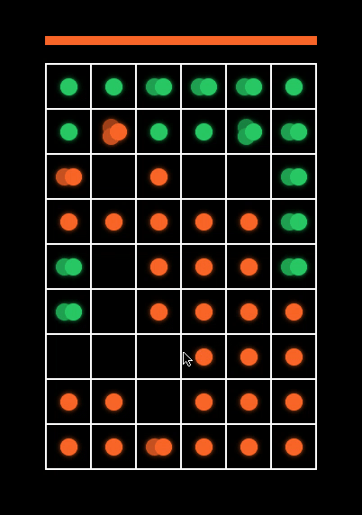

# GAME AI : Chain Reaction

## Group Members:
<ul>
  <li>Rahul Dev E (re263)</li>
  <li>Shikha Vyaghra (sv629)</li>
  <li>Jacob Celestine (jc2777)</li>
</ul>

## Goals:
<ol>
  <li>The goal of this project is to study the behaviour of an intelligent agent when the principles of collaboration and competition are added to a zero-sum board game.</li>
  <li>We try to apply a combination of cooperative and non-cooperative game theory by enforcing additional rules and restrictions.</li>
  <li>Multiple approaches such as Expectiminimax algorithm, Monte Carlo Tree Search algorithms, and Reinforcement Learning will be explored.</li>
</ol>

## Normal Rules:
<ol>
  <li>Players take turns to place orbs of their corresponding colours. A player can only place an orb in an empty cell or a cell which already contains coloured orbs of his own. When two or more orbs are placed in the same cell, they stack up.</li>
  <li>The critical mass of a cell is equal to the number of adjacent cells, i.e., 4 for usual cells, 3 for edge cells and 2 for corner cells.</li>
  <li>When a cell is loaded with orbs equal to its critical mass, the stack explodes. As a result of the explosion, all the orbs from the initial cell fly to adjacent cells. The explosions might result in overloading of an adjacent cell and the chain reaction of explosion continues until every cell is stable.</li>
  <li>When a red cell explodes and there are green cells around, the green cells are converted to red, and the other rules of explosions still follow. The same rule is applicable for other colours.</li>
</ol>

## Demo:

## Additional Rules & Restrictions:
<ol>
  <li>The game will be limited to a maximum of 4-players.</li>
  <li>The game board will be restricted to at most an 8x8 grid.</li>
  <li>Special orbs will be generated randomly, which would be controllable by any two randomly chosen players.</li>
  <li>After a few turns, the special orb will be divided randomly between the players who could control it before. This introduces a probabilistic element into the game, leading to unpredictable results.</li>
  <li>With the appearance of special orbs, two players who were competing against each other now have a chance to team up to finish another players. On the other hand, since the orbs will eventually decay, the two allied players have to account for the eventual break up of the alliance, similar to how kingdoms create and break alliances, leading to unexpected victories.</li>
</ol>

## Status
- [x] Basic Game Framework
- [ ] Front-end
- [ ] Flask App
- [x] Expectiminimax
- [ ] Monte Carlo Tree Search
- [ ] Reinforcement Learning
- [ ] Gameplay Evaluation
- [ ] Final Report